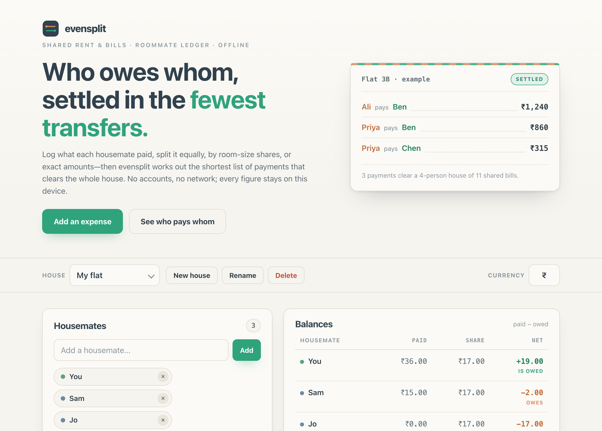

# evensplit

**Who owes whom, settled in the fewest transfers.** A calm rent &amp; shared-bill splitter for roommates. Log what each housemate paid, split it equally, by shares, or by exact amounts — then evensplit works out the shortest list of payments that clears the whole house. 100% client-side, zero dependencies, works fully offline.

## Why

Splitting a shared house is annoying maths. Rent goes on one card, groceries on another, the wifi bill on a third — and by the end of the month nobody remembers who's up and who's down. Most splitter apps want an account, your contacts, and a connection.

evensplit is deliberately small and private. Add your housemates, log expenses as they happen, and it keeps a running ledger of each person's net position (what they paid minus what they owe). The headline feature is the **settle-up**: instead of everyone paying everyone, it computes the **fewest transfers** that clear the group, and lists them in plain language — *"Ali pays Ben ₹1,240."* Copy that summary into your group chat and you're done.

## Features

- **Multiple houses** — keep separate groups for your flat, a trip, or a one-off dinner. Each is stored on its own.
- **Three split methods** — **equal** among the people you tick, **shares** (weights — split rent by room size, or a simple 2:1:1), or **exact** amounts per person. Exact and shares are validated so they reconcile to the total.
- **Cent-exact reconciliation** — splits use largest-remainder apportionment, so every share adds up to the expense amount exactly. No cent is ever lost or invented by rounding.
- **Live balances** — a table of each housemate's paid, share, and **net**, clearly marked *is owed* / *owes* / *even*.
- **Minimum-transfer settlement** — a greedy min-cash-flow algorithm matches the biggest creditor against the biggest debtor until everyone is square, so the group clears with the fewest payments.
- **Copyable summary** — one click copies a plain-text balances-and-who-pays-whom summary to paste into any chat.
- **Handles the awkward cases** — everyone already even (no transfers), a single person, and **removing someone who has history** (they're kept as a former member so the ledger still reconciles).
- **100% offline** — no accounts, no network calls, no tracking. Everything is saved only in this browser's local storage.

## Quickstart

Just open `index.html` in any modern browser — no build step, no server, no install.

- **Local:** double-click `index.html`, or run a static server in the folder.
- **Hosted:** **[Open evensplit live](https://sreenivas-sadhu-prabhakara.github.io/evensplit/)**

Your houses, people, and expenses are saved in your browser's local storage, so they persist between visits on the same device.

## Privacy

- A strict Content-Security-Policy sets `connect-src 'none'`: the app **cannot** make any network request, even if it tried.
- No external fonts, scripts, images, or analytics. Everything is self-contained in three files.
- All logic runs in your browser. Nothing about your house or your money is ever transmitted or stored anywhere but your own device.
- Because there are no network dependencies, it keeps working offline — download it once and it runs with no connection at all.

## Disclaimer

evensplit is a convenience tool for **informal splitting between friends and roommates only**. It is **not** a financial, accounting, tax, or payments product, it does not move money, and it is not a substitute for professional advice. The figures it produces are estimates for your own reference — **always verify them yourselves before anyone pays anyone**. This software is provided under the MIT License, "as is", without warranty of any kind; the authors accept no liability for any loss, dispute, or damage arising from its use.

## License

[MIT](./LICENSE) © 2026 Sreenivas Sadhu Prabhakara
